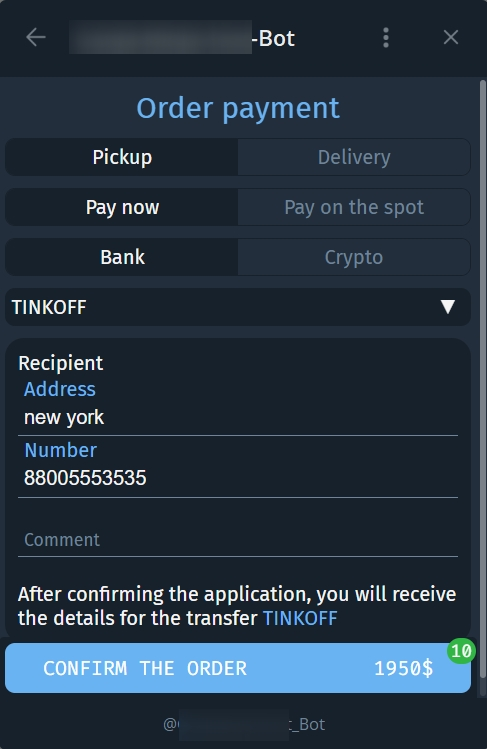
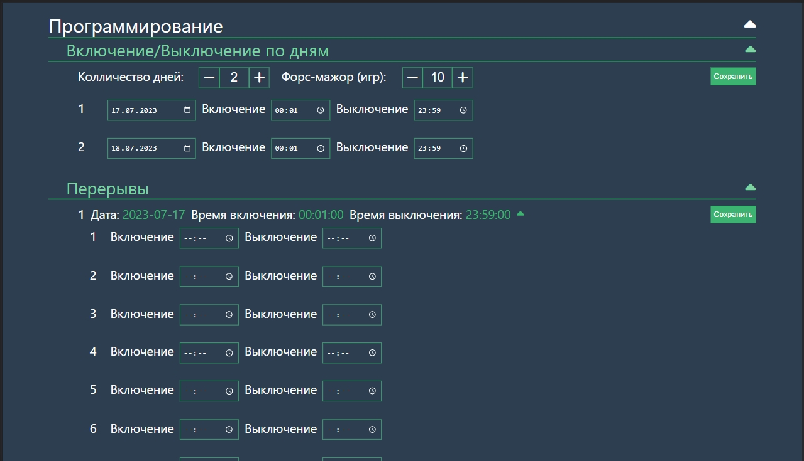

<h1 align="center">Hi, guys! </h1>

    <b>Welcome to my page!</b>  
    <i>
        I'm Andrey. </i>
        <b>Frontend-developer</b> 
        <i>Open to collaborating on interesting and innovative projects. 
    </i>

### My contacts
 
 
## 

### Stack
 
 
 
 
 
 
 
 
 
 
 
 
 
 
 
 
 ##
 
### Part of my commercial projects:
+ 

  
<h3>Online clothing store</h3>

  A clothing store integrated into telegram.
   
  Project stack: <i> Vue + vite, Vuex, Telegram Web Apps, Axios, Python, FastApi, PostgreSQL, Django, TelegramApi </i>

  ##
  <table>
    <tr>
      <td>
        
      </td>
      <td>
        
      </td>
    </tr>
    <tr>
      <td>
        
      </td>
      <td>
        
      </td>
    </tr>
  
  </table>

  
  

+  

    
<h3>Web bot for playing roulette</h3>

    A robot playing roulette according to the set strategy.
     
    Project stack: <i> Vue + vite, nginx, Vue + Chart.js, Axios, Python, FastApi, TelegramApi </i>

    ##
    <table>
      <tr>
        <td>
          
        </td>
        <td>
          
        </td>
      </tr>
      <tr>
        <td>
          
        </td>
        <td>
          
        </td>
      </tr>
      <tr>
        <td>
          
        </td>
        
      </tr>
    </table>

    
    

 +  

    
<h3>Сargo transportation website</h3>

    Large-scale multi-page website.
    Dynamic routing, news feed, application processing, calculators for calculating the application price, feedback.
     
    Project stack:<i> Vue + vite, Axios, Python, PostgreSQL, Django, Redis</i>

    ##
    <table>
      <tr>
        <td>
          
        </td>
        <td>
          
        </td>
      </tr>
      <tr>
        <td>
          
        </td>
        <td>
          
        </td>
      </tr>
    </table>

    
    

##

 ### Statistics

 <table>
  <tr>
    <td>
       
    </td>
     <td>
       
    </td>
    <!-- <td>
     
    </td> -->
  </tr>

</table>

 ##
 
 ### Coding activity over all time this profile

##

 

<!-- https://shields.io/
https://github.com/simple-icons/simple-icons/blob/master/slugs.md
https://github.com/Ileriayo/markdown-badges
https://github.com/vn7n24fzkq/github-profile-summary-cards -->
